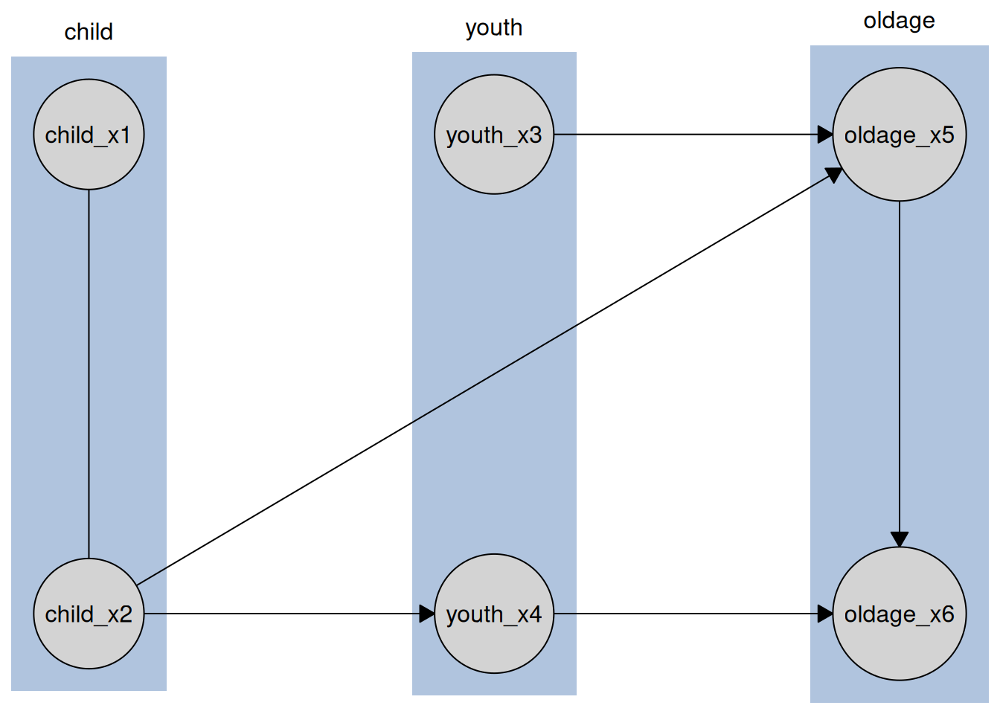

# Extending causalDisco with new algorithms

``` r

library(causalDisco)
#> causalDisco startup:
#>   Java heap size requested: 2 GB
#>   Tetrad version: 7.6.10
#>   Java successfully initialized with 2 GB.
#>   To change heap size, set options(java.heap.size = 'Ng') or Sys.setenv(JAVA_HEAP_SIZE = 'Ng') *before* loading.
#>   Restart R to apply changes.
```

This article illustrates how to add a new algorithm to causalDisco from
bnlearn, pcalg and Tetrad. Both bnlearn and pcalg are R packages and
therefore share the same interface, while Tetrad is a Java library and
requires a slightly different integration pattern.

## bnlearn and pcalg

Suppose we want to add the Hybrid Parents and Children (HPC) algorithm
from bnlearn. We can integrate it into causalDisco by creating a new
function `hpc()`.

HPC is a constraint-based algorithm, so it requires a conditional
independence test and a significance level alpha. It returns a PDAG, so
we set the `graph_class` attribute to `"PDAG"`.

The function takes an `engine` argument, which specifies which
implementation of the algorithm to use. Even though we only add HPC from
bnlearn in this example, we set up the structure to allow for multiple
engines in the future. The `...` argument allows us to pass additional
arguments to the underlying algorithm and test.

The code for the `hpc()` function is as follows:

``` r

hpc <- function(
  engine = c("bnlearn"),
  test,
  alpha = 0.05,
  ...
) {
  engine <- match.arg(engine)

  make_method(
    method_name = "hpc",
    engine = engine,
    engine_fns = list(
      bnlearn = function(...) make_runner(engine = "bnlearn", alg = "hpc", ...)
    ),
    test = test,
    alpha = alpha,
    graph_class = "PDAG",
    ...
  )
}
```

We see that the `hpc()` function is very simple, and all the logic is
handled by the
[`make_method()`](https://disco-coders.github.io/causalDisco/reference/make_method.md)
and
[`make_runner()`](https://disco-coders.github.io/causalDisco/reference/make_runner.md)
functions.

Once defined, the HPC algorithm can be used like any other method in
causalDisco. We first construct the method using `hpc()`, and then pass
it to
[`disco()`](https://disco-coders.github.io/causalDisco/reference/disco.md).
Here we demonstrate using the included `tpc_example` dataset:

``` r

data(tpc_example)
hpc_bnlearn <- hpc(engine = "bnlearn", test = "fisher_z", alpha = 0.05)
hpc_bnlearn_result <- disco(tpc_example, hpc_bnlearn)
#> The learned graph is not a valid CPDAG because of conflicting edge orientations, which can happen due to statistical errors in finite samples, violations of faithfulness, or latent confounding; it is reported as PDAG instead.
plot(hpc_bnlearn_result)
```


To implement a **score-based** algorithm instead, the structure would
remain the same. The main difference is that the method would accept a
`score` argument rather than `test` and `alpha`. A **hybrid** algorithm
would accept `test`, `alpha`, and `score` arguments.

To implement an algorithm from pcalg rather than bnlearn, we would
follow the same structure but change all instances of `"bnlearn"` to
`"pcalg"`.

## A fully custom algorithm implemented in R

Here we show how to use a plain R function you wrote yourself as an
algorithm, instead of from a package. The `causalDisco` engine’s
`CausalDiscoSearch$set_alg()` accepts such a function directly, so you
can reuse its data/knowledge/test handling while swapping out only the
search procedure.

A **constraint-based** custom algorithm has the signature
`function(data, knowledge, suff_stat)`, mirroring
[`tpc_run()`](https://disco-coders.github.io/causalDisco/reference/tpc_run.md)/[`tfci_run()`](https://disco-coders.github.io/causalDisco/reference/tfci_run.md).
A **score-based** custom algorithm instead has the signature
`function(score)`, mirroring
[`tges_run()`](https://disco-coders.github.io/causalDisco/reference/tges_run.md);
pass `type = "score"` to `set_alg()` for these. Here we implement a
(trivial) constraint-based algorithm that just calls
[`tpc_run()`](https://disco-coders.github.io/causalDisco/reference/tpc_run.md)
with whatever test the search object was configured with.

To wire this into
[`disco()`](https://disco-coders.github.io/causalDisco/reference/disco.md),
with the same knowledge injection and return type as the built-in
algorithms, wrap a `CausalDiscoSearch` object in
[`make_method()`](https://disco-coders.github.io/causalDisco/reference/make_method.md),
exactly as we did for `hpc()` above. One thing to watch out for:
`search$set_test()` doesn’t just resolve the test to a function
(afterwards available as `search$test`), it also computes the sufficient
statistic that `run_search()` passes into your algorithm’s `suff_stat`
argument. So your custom algorithm should read the test off
`search$test` rather than hardcoding one, to keep the two in sync.

``` r

my_alg <- function(test = "fisher_z", alpha = 0.05, ...) {
  make_method(
    method_name = "my_alg",
    engine = "causalDisco",
    engine_fns = list(
      causalDisco = function(test, alpha, ...) {
        search <- CausalDiscoSearch$new()
        search$set_test(test, alpha)

        my_search_alg <- function(data, knowledge, suff_stat) {
          tpc_run(
            data = data,
            knowledge = knowledge,
            suff_stat = suff_stat,
            test = search$test
          )
        }
        search$set_alg(my_search_alg)

        list(
          set_knowledge = function(knowledge) search$set_knowledge(knowledge),
          run = function(data) search$run_search(data)
        )
      }
    ),
    test = test,
    alpha = alpha,
    graph_class = "PDAG",
    ...
  )
}
```

`my_alg()` can now be used exactly like any built-in method:

``` r

data(tpc_example)
kn <- knowledge(
  tpc_example,
  tier(
    child ~ tidyselect::starts_with("child"),
    youth ~ tidyselect::starts_with("youth"),
    oldage ~ tidyselect::starts_with("oldage")
  )
)
result <- disco(
  data = tpc_example,
  method = my_alg(test = "fisher_z"),
  knowledge = kn
)
plot(result)
```



## Tetrad

We will illustrate how to make a custom version (which actually does the
same as our implementation, just with some defensive programming
omitted) of the BOSS algorithm from Tetrad. Tetrad algorithms follow a
slightly different integration pattern because Tetrad is a Java library
rather than an R package.

To add a new Tetrad algorithm, first register it with
[`register_tetrad_algorithm()`](https://disco-coders.github.io/causalDisco/reference/register_tetrad_algorithm.md).
This function requires:

- The algorithm name.
- A setup function that configures a `TetradSearch` object to execute
  the algorithm.

The setup function receives the TetradSearch object as its first
argument, along with any additional parameters passed via `...` when the
method is constructed. Its responsibilities are to:

1.  Configure the TetradSearch object with the appropriate parameters
    and score.
2.  Instantiate the correct Tetrad algorithm class.

The fully qualified class name can be identified by inspecting the
Tetrad source code at:

https://github.com/cmu-phil/tetrad

Be sure to browse the version corresponding to the installed Tetrad
release. The relevant Java classes are located under:

https://github.com/cmu-phil/tetrad/tree/development/tetrad-lib/src/main/java

``` r

register_tetrad_algorithm(
  "my_boss_variant",
  function(
    self,
    num_starts = 1,
    use_bes = TRUE,
    use_data_order = TRUE,
    output_cpdag = TRUE
  ) {
    self$set_params(
      USE_BES = use_bes,
      NUM_STARTS = num_starts,
      USE_DATA_ORDER = use_data_order,
      OUTPUT_CPDAG = output_cpdag
    )

    self$alg <- rJava::.jnew(
      "edu/cmu/tetrad/algcomparison/algorithm/oracle/cpdag/Boss",
      self$score
    )
    self$alg$setKnowledge(self$knowledge)
  }
)
```

You can view all the custom registered Tetrad algorithms using
[`list_registered_tetrad_algorithms()`](https://disco-coders.github.io/causalDisco/reference/list_registered_tetrad_algorithms.md),
and reset it using
[`reset_tetrad_alg_registry()`](https://disco-coders.github.io/causalDisco/reference/reset_tetrad_alg_registry.md).

The structure of the method function for a Tetrad algorithm is then the
exact same as for bnlearn and pcalg, as seen below. BOSS is a
**score-based** algorithm, so it accepts a `score` argument. The
algorithm returns a PDAG, so we set the `graph_class` attribute to
`"PDAG"`.

``` r

my_boss_variant <- function(
  engine = "tetrad",
  score,
  ...
) {
  engine <- match.arg(engine)

  make_method(
    method_name = "my_boss_variant",
    engine = engine,
    engine_fns = list(
      tetrad = function(...) {
        make_runner(engine = "tetrad", alg = "my_boss_variant", ...)
      }
    ),
    score = score,
    graph_class = "PDAG",
    ...
  )
}
```

We can now run `my_boss_variant()` like any other method in causalDisco.

``` r

# Ensure Tetrad is installed and Java is working before running the algorithm
if (verify_tetrad()$installed && verify_tetrad()$java_ok) {
  my_boss_variant_tetrad <- my_boss_variant(
    engine = "tetrad",
    score = "sem_bic"
  )
  my_boss_variant_tetrad_result <- disco(tpc_example, my_boss_variant_tetrad)
  plot(my_boss_variant_tetrad_result)
}
```


Once again, if using a hybrid or constraint-based algorithm rather than
a score-based one, the structure would remain the same but the method
would accept different arguments (e.g., `test` and `alpha` for a
constraint-based algorithm).

Finally, we clean up the custom registered Tetrad algorithm

``` r

reset_tetrad_alg_registry()
```

## A brand-new engine

Everything above adds a new *algorithm* to one of the built-in engines
(`"bnlearn"`, `"causalDisco"`, `"pcalg"`, `"tetrad"`). This section
shows how to add a new *engine* to causalDisco.

[`register_engine()`](https://disco-coders.github.io/causalDisco/reference/register_engine.md)
takes an engine name, a `make_runner_fn`, and the packages it depends
on. `make_runner_fn` must accept `alg` and `...`, and must return a
*runner*: a list with a
[`set_knowledge()`](https://disco-coders.github.io/causalDisco/reference/set_knowledge.md)
function and a `run()` function. This is the same runner shape returned
by
[`make_runner()`](https://disco-coders.github.io/causalDisco/reference/make_runner.md)
itself, and by the `engine_fns` we wrote by hand in the “fully custom
algorithm” example above. `run()` should return its graph wrapped with
[`as_disco()`](https://disco-coders.github.io/causalDisco/reference/as_disco.md),
which is what
[`disco()`](https://disco-coders.github.io/causalDisco/reference/disco.md),
[`print()`](https://rdrr.io/r/base/print.html), and
[`plot()`](https://disco-coders.github.io/causalDisco/reference/plot.md)
expect.

Here we register a (trivial) `"always_empty"` engine that ignores its
input and always returns the empty graph over the columns of the input
data, to show the registration mechanics.

``` r

always_empty_runner <- function(alg, ...) {
  kn <- knowledge()
  list(
    set_knowledge = function(knowledge) kn <<- knowledge,
    run = function(data) {
      cg <- caugi::caugi(
        from = character(0),
        edge = character(0),
        to = character(0),
        nodes = names(data),
        class = "PDAG"
      )
      as_disco(cg, kn)
    }
  )
}

register_engine("always_empty", always_empty_runner)
```

With the engine registered, we can wire up a method for it with
[`make_method()`](https://disco-coders.github.io/causalDisco/reference/make_method.md)
and
[`make_runner()`](https://disco-coders.github.io/causalDisco/reference/make_runner.md),
just like `hpc()` and `my_boss_variant()` above:

``` r

empty_alg <- function(engine = "always_empty", ...) {
  engine <- match.arg(engine)

  make_method(
    method_name = "empty_alg",
    engine = engine,
    engine_fns = list(
      always_empty = function(...) {
        make_runner(engine = "always_empty", alg = "empty_alg", ...)
      }
    ),
    graph_class = "PDAG",
    ...
  )
}
```

``` r

disco(tpc_example, empty_alg())
#> <Disco CPDAG: 6 nodes | 0 edges>
#>   nodes: child_x2, child_x1, youth_x4, youth_x3, oldage_x6, oldage_x5
```

You can view all registered engines with
[`list_registered_engines()`](https://disco-coders.github.io/causalDisco/reference/list_registered_engines.md),
and clear them with
[`reset_engine_registry()`](https://disco-coders.github.io/causalDisco/reference/reset_engine_registry.md):

``` r

list_registered_engines()
#> [1] "always_empty"
reset_engine_registry()
```

## Conclusion

In this article, we have illustrated how to add new algorithms to
causalDisco, both from the R packages pcalg and bnlearn and from Tetrad,
as well as how to register an entirely new engine backend.

If you have any feedback or suggestions for improvement on the API and
functionality for extending causalDisco, please let us know by opening
an issue on GitHub.
